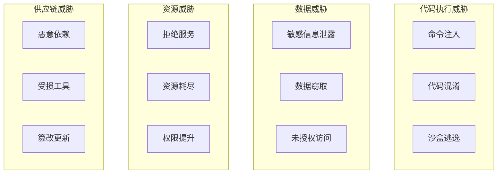
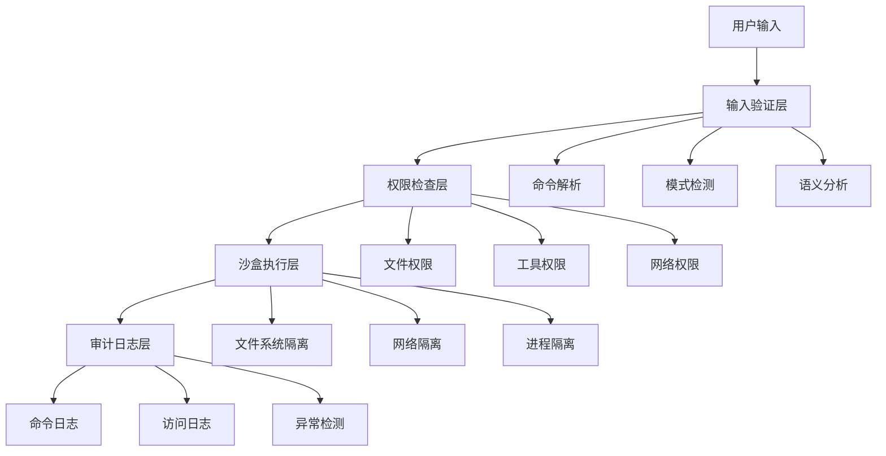
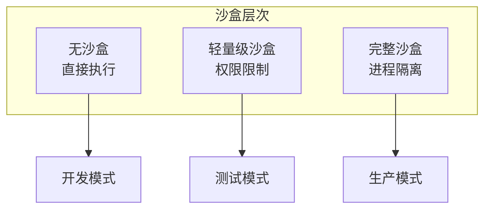
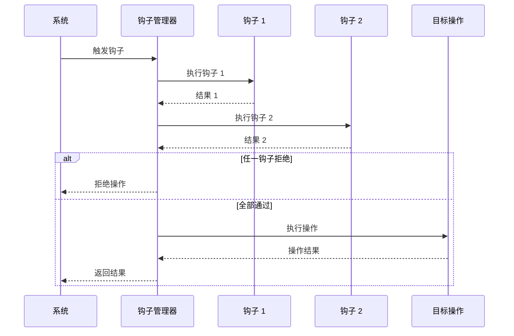

# 第 34 章：安全模型总论

> 本章目标：全面分析 Claude Code 的安全模型架构，从威胁模型到防护机制。

## 安全威胁全景

### 威胁分类



### 威胁来源

| 来源 | 描述 | 缓解措施 |
|------|------|----------|
| **AI 生成的恶意命令** | LLM 生成危险代码 | 多层验证、权限控制 |
| **用户输入注入** | 恶意用户输入 | 输入验证、沙盒 |
| **工具链漏洞** | 依赖工具存在漏洞 | 最小权限、定期更新 |
| **外部网络攻击** | 网络服务攻击 | 网络隔离、认证 |

## 多层防护体系



### 输入验证层

**命令解析**

```typescript
// 使用 Tree-sitter 进行精确解析
import { parseCommand } from './parser'

function validateInput(command: string): ValidationResult {
  // 1. 解析命令
  const parsed = parseCommand(command)

  // 2. 检查语法
  if (!parsed.isValid) {
    return { valid: false, error: 'Invalid syntax' }
  }

  // 3. 提取组件
  const { baseCommand, args, redirects } = parsed

  // 4. 验证各组件
  return {
    valid: true,
    baseCommand,
    args,
    redirects,
  }
}
```

**模式检测**

```typescript
// 危险模式库
const DANGEROUS_PATTERNS = [
  // 命令替换
  { pattern: /\$\(/, severity: 'high' },
  { pattern: /`/, severity: 'high' },

  // 重定向
  { pattern: />/, severity: 'medium' },

  // 管道
  { pattern: /\|/, severity: 'low' },

  // 控制字符
  { pattern: /[\x00-\x1F\x7F]/, severity: 'high' },
]

function checkPatterns(command: string): PatternCheckResult {
  const matches = []

  for (const { pattern, severity } of DANGEROUS_PATTERNS) {
    if (pattern.test(command)) {
      matches.push({ pattern: pattern.source, severity })
    }
  }

  return {
    hasPatterns: matches.length > 0,
    matches,
  }
}
```

### 权限检查层

**文件权限**

```typescript
interface FilePermissionRule {
  type: 'allow' | 'deny'
  pattern: string
  operations: ('read' | 'write' | 'execute')[]
}

interface FilePermissionContext {
  mode: 'default' | 'auto' | 'always-allow'
  allowList: FilePermissionRule[]
  denyList: FilePermissionRule[]
  workingDirectory: string
}

function checkFilePermission(
  path: string,
  operation: 'read' | 'write' | 'execute',
  context: FilePermissionContext,
): PermissionDecision {
  // 1. 检查拒绝列表
  for (const rule of context.denyList) {
    if (matches(rule.pattern, path) && rule.operations.includes(operation)) {
      return { decision: 'deny', reason: `Denied by rule: ${rule.pattern}` }
    }
  }

  // 2. 检查允许列表
  for (const rule of context.allowList) {
    if (matches(rule.pattern, path) && rule.operations.includes(operation)) {
      return { decision: 'allow' }
    }
  }

  // 3. 默认决策
  switch (context.mode) {
    case 'always-allow':
      return { decision: 'allow' }
    case 'auto':
      return isSafePath(path) ? { decision: 'allow' } : { decision: 'ask' }
    default:
      return { decision: 'ask', reason: 'User confirmation required' }
  }
}
```

**工具权限**

```typescript
interface ToolPermission {
  tool: string
  allowed: boolean
  patterns?: string[]
}

function checkToolPermission(
  tool: string,
  input: unknown,
  permissions: ToolPermission[],
): PermissionDecision {
  const permission = permissions.find(p => p.tool === tool)

  if (!permission) {
    // 默认需要确认
    return { decision: 'ask', reason: `Tool ${tool} not in permissions` }
  }

  if (!permission.allowed) {
    return { decision: 'deny', reason: `Tool ${tool} is not allowed` }
  }

  // 检查输入模式
  if (permission.patterns) {
    const inputStr = JSON.stringify(input)
    for (const pattern of permission.patterns) {
      if (matches(pattern, inputStr)) {
        return { decision: 'allow' }
      }
    }
    return { decision: 'deny', reason: 'Input does not match allowed patterns' }
  }

  return { decision: 'allow' }
}
```

### 沙盒执行层

**沙盒类型**



**沙盒配置**

```typescript
interface SandboxConfig {
  filesystem: {
    readonly: string[]
    readwrite: string[]
    hidden: string[]
  }
  network: {
    allow: boolean
    allowedHosts?: string[]
    deniedHosts?: string[]
  }
  process: {
    maxMemory?: number
    maxCpu?: number
    timeout?: number
  }
}

// 默认沙盒配置
const DEFAULT_SANDBOX_CONFIG: SandboxConfig = {
  filesystem: {
    readonly: [
      '/usr',
      '/bin',
      '/lib',
    ],
    readwrite: [
      '/tmp',
      '$HOME/project',
    ],
    hidden: [
      '/etc/shadow',
      '/etc/passwd',
    ],
  },
  network: {
    allow: false,
  },
  process: {
    maxMemory: 1024 * 1024 * 1024,  // 1GB
    maxCpu: 0.8,                    // 80%
    timeout: 30000,                 // 30s
  },
}
```

### 审计日志层

```typescript
interface AuditLog {
  timestamp: number
  event: 'command' | 'file_access' | 'permission' | 'error'
  data: {
    command?: string
    path?: string
    permission?: string
    decision?: 'allow' | 'deny' | 'ask'
    userId?: string
    sessionId?: string
  }
}

// 审计日志记录
function logAudit(event: Partial<AuditLog>) {
  const log: AuditLog = {
    timestamp: Date.now(),
    event: event.event || 'command',
    data: event.data || {},
  }

  // 写入审计日志
  appendAuditLog(log)

  // 异常检测
  if (isAnomalous(log)) {
    alertSecurity(log)
  }
}
```

## 权限系统架构

### 权限规则语法

```typescript
type PermissionRule =
  | { type: 'tool'; tool: string; allowed: boolean }
  | { type: 'path'; path: string; operations: FileOperation[]; allowed: boolean }
  | { type: 'command'; pattern: string; allowed: boolean }
  | { type: 'network'; host: string; allowed: boolean }

// 规则解析
function parseRule(ruleStr: string): PermissionRule {
  // 工具规则: tool:ls:allow
  const toolMatch = ruleStr.match(/^tool:(\w+):(allow|deny)$/)
  if (toolMatch) {
    return {
      type: 'tool',
      tool: toolMatch[1],
      allowed: toolMatch[2] === 'allow',
    }
  }

  // 路径规则: path:/tmp:rw:allow
  const pathMatch = ruleStr.match(/^path:(.+):([rwx]+):(allow|deny)$/)
  if (pathMatch) {
    return {
      type: 'path',
      path: pathMatch[1],
      operations: parseOperations(pathMatch[2]),
      allowed: pathMatch[3] === 'allow',
    }
  }

  // 命令规则: command:git*:allow
  const cmdMatch = ruleStr.match(/^command:(.+):(allow|deny)$/)
  if (cmdMatch) {
    return {
      type: 'command',
      pattern: cmdMatch[1],
      allowed: cmdMatch[2] === 'allow',
    }
  }

  throw new Error(`Invalid permission rule: ${ruleStr}`)
}
```

### 规则匹配算法

```typescript
function matchesRule(rule: PermissionRule, input: unknown): boolean {
  switch (rule.type) {
    case 'tool':
      return input.tool === rule.tool

    case 'path':
      return matchPathPattern(rule.path, input.path)

    case 'command':
      return matchCommandPattern(rule.pattern, input.command)

    case 'network':
      return matchHostPattern(rule.host, input.host)
  }
}

function matchPathPattern(pattern: string, path: string): boolean {
  // 支持 * 通配符
  const regex = new RegExp(
    '^' + pattern.replace(/\*/g, '.*').replace(/\?/g, '.') + '$'
  )
  return regex.test(path)
}
```

### 权限继承

```typescript
interface PermissionHierarchy {
  parent?: PermissionHierarchy
  rules: PermissionRule[]
}

function resolvePermissions(
  hierarchy: PermissionHierarchy,
): PermissionRule[] {
  const rules: PermissionRule[] = []

  // 收集所有层级的规则
  let current: PermissionHierarchy | undefined = hierarchy
  while (current) {
    rules.unshift(...current.rules)
    current = current.parent
  }

  // 合并规则
  return mergeRules(rules)
}
```

## 钩子系统

### 钩子类型

```typescript
type HookType =
  | 'SessionStart'      // 会话开始
  | 'SessionEnd'        // 会话结束
  | 'ToolUse'           // 工具使用前
  | 'ToolUseResult'     // 工具使用后
  | 'CommandExecute'    // 命令执行前
  | 'CommandResult'     // 命令执行后
  | 'FileRead'          // 文件读取前
  | 'FileWrite'         // 文件写入前
  | 'PermissionCheck'   // 权限检查

interface Hook {
  type: HookType
  callback: (context: HookContext) => HookResult | Promise<HookResult>
}

interface HookContext {
  input?: unknown
  tool?: string
  command?: string
  path?: string
  permission?: PermissionDecision
}

interface HookResult {
  allowed?: boolean
  modifiedInput?: unknown
  message?: string
}
```

### 钩子执行流程



### 钩子安全

```typescript
// 钩子也需要权限控制
function validateHook(hook: Hook): ValidationResult {
  // 1. 检查钩子来源
  if (hook.source === 'untrusted') {
    return { valid: false, error: 'Untrusted hooks not allowed' }
  }

  // 2. 检查钩子权限
  const requiredPermissions = getRequiredPermissions(hook.type)
  if (!hasPermissions(requiredPermissions)) {
    return { valid: false, error: 'Insufficient permissions' }
  }

  // 3. 沙盒执行
  hook.callback = sandboxFunction(hook.callback)

  return { valid: true }
}
```

## 作者观点：安全模型的权衡

### 优点

1. **多层防护**：防御深度，任何单点失效不会导致系统崩溃
2. **灵活配置**：支持细粒度的权限控制
3. **用户控制**：用户可以自定义安全策略
4. **审计追踪**：完整的操作日志

### 缺点

1. **复杂度**：配置和实现都比较复杂
2. **性能开销**：多层检查影响执行速度
3. **用户负担**：需要用户理解安全概念
4. **误报率**：可能过度阻止合法操作

### 改进建议

1. **简化配置**：提供预设的安全模板
2. **智能建议**：根据用户行为自动调整
3. **可视化**：图形化展示权限状态
4. **自适应**：根据上下文动态调整安全级别

## 本章小结

本章全面介绍了 Claude Code 的安全模型：
1. **威胁全景**：各种安全威胁的分类和来源
2. **多层防护**：输入验证、权限检查、沙盒执行、审计日志
3. **权限系统**：规则语法、匹配算法、继承机制
4. **钩子系统**：类型定义、执行流程、安全控制

## 下一章预告

附录部分将包含隐藏命令清单和构建指南。
