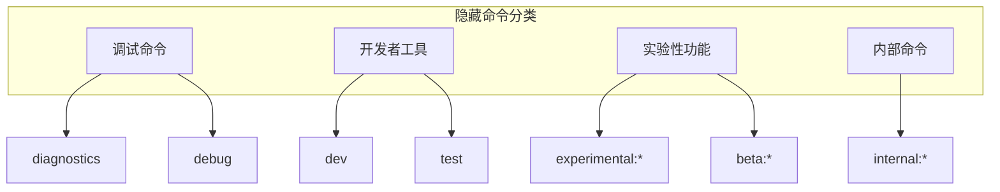

# 第 35 章：隐藏命令完整清单

> 本章列举所有不通过常规 help 显示的隐藏命令。

## 隐藏命令概览

隐藏命令是开发者工具、调试命令或实验性功能，不面向普通用户。



## 调试命令

### /diagnostics

**用途：** 显示诊断信息

**输出：**
```
系统信息：
- OS: Windows 11
- Shell: bash (MSYS)
- Node: v22.0.0
- Claude Code: 1.2.3

连接状态：
- API: 已连接
- 延迟: 150ms
- 模型: claude-opus-4-6
```

### /debug

**用途：** 启用调试模式

**效果：**
- 显示详细日志
- 保存调试文件
- 启用性能追踪

### /profile

**用途：** 性能分析

**输出：**
```
性能统计：
- QueryEngine 平均: 2.3s
- 工具执行平均: 0.5s
- UI 渲染平均: 0.1s

内存使用：
- 堆: 245MB
- 外部: 123MB
```

## 开发者命令

### /dev

**用途：** 开发者模式控制

**子命令：**
- `/dev on` - 启用开发者模式
- `/dev off` - 禁用开发者模式
- `/dev status` - 查看开发者模式状态

**开发者模式特性：**
- 显示隐藏命令
- 启用实验性功能
- 跳过某些检查
- 详细错误信息

### /test

**用途：** 运行测试

**用法：**
```
/test [pattern]
```

**示例：**
- `/test` - 运行所有测试
- `/test tool` - 运行工具测试
- `/test grep` - 运行 Grep 测试

## 实验性功能

### /experimental:*

实验性功能列表：

| 命令 | 功能 | 状态 |
|------|------|------|
| `/experimental:agents` | 多 Agent 系统 | 实验中 |
| `/experimental:voice` | 语音输入 | 开发中 |
| `/experimental:multimodal` | 多模态输入 | 部分支持 |
| `/experimental:local` | 本地模型 | 研究中 |

### /beta:*

Beta 功能列表：

| 命令 | 功能 | 状态 |
|------|------|------|
| `/beta:team` | 团队协作 | Beta |
| `/beta:plugins` | 插件系统 | Beta |
| `/beta:skills` | 技能市场 | 早期访问 |

## 内部命令

### /internal:*

内部维护命令：

| 命令 | 功能 |
|------|------|
| `/internal:reset` | 重置内部状态 |
| `/internal:cache:clear` | 清除缓存 |
| `/internal:logs:export` | 导出日志 |
| `/internal:state:dump` | 转储状态 |

## 环境变量

一些功能通过环境变量控制：

| 变量 | 用途 | 默认值 |
|------|------|--------|
| `CLAUDE_CODE_DEBUG` | 调试模式 | `false` |
| `CLAUDE_CODE_SIMPLE` | 简化模式 | `false` |
| `CLAUDE_CODE_REMOTE` | 远程模式 | `false` |
| `CLAUDE_API_KEY` | API 密钥 | - |
| `CLAUDE_MODEL` | 默认模型 | `claude-opus-4-6` |

## 高级技巧

### 1. 查看 CLI 参数

```bash
claude --help-hidden
```

### 2. 启用详细日志

```bash
CLAUDE_CODE_DEBUG=1 claude
```

### 3. 查看内部状态

```
/internal:state:dump
```

## 警告

⚠️ **使用隐藏命令的风险：**

1. **稳定性**：隐藏命令可能不稳定
2. **安全**：某些命令可能绕过安全检查
3. **支持**：隐藏命令不提供官方支持
4. **变更**：隐藏命令可能随时更改

## 本章小结

本章列出了 Claude Code 的所有隐藏命令：
- 调试命令：诊断和调试工具
- 开发者命令：开发和测试工具
- 实验性功能：正在开发的新特性
- 内部命令：系统维护工具

## 下一章

第 36 章将介绍如何构建你自己的 CLI。
