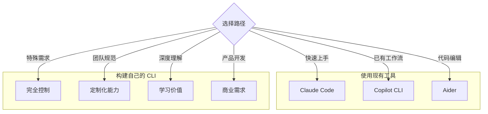
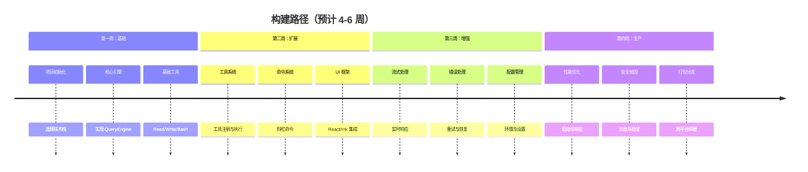
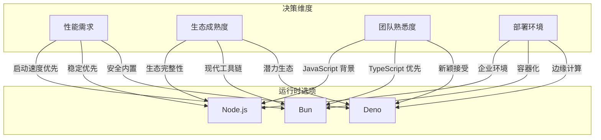
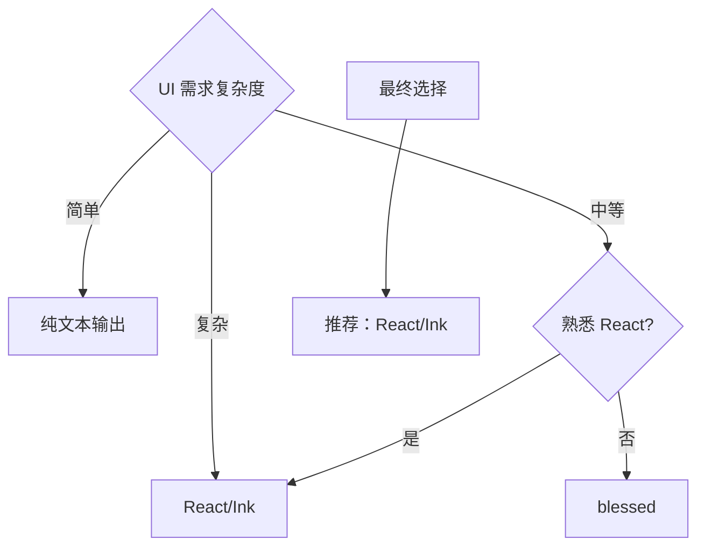
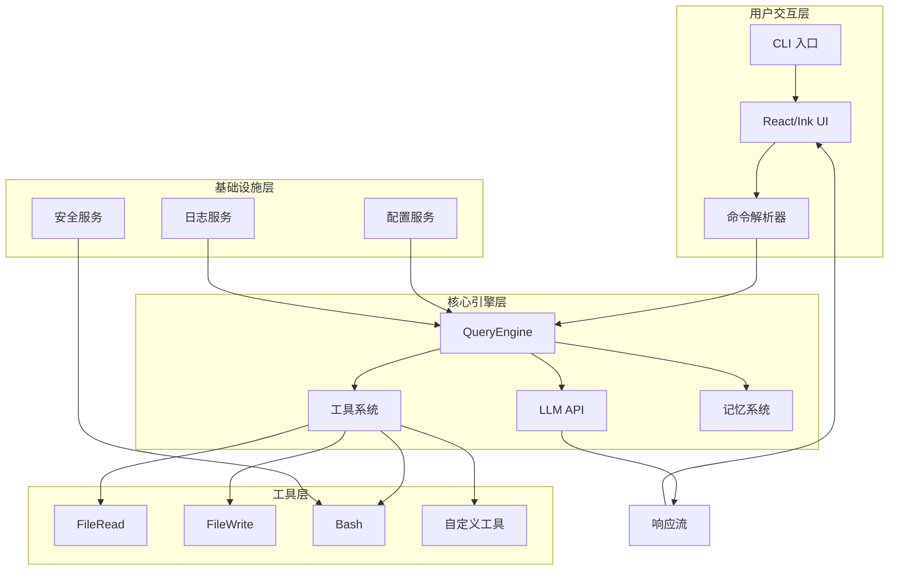
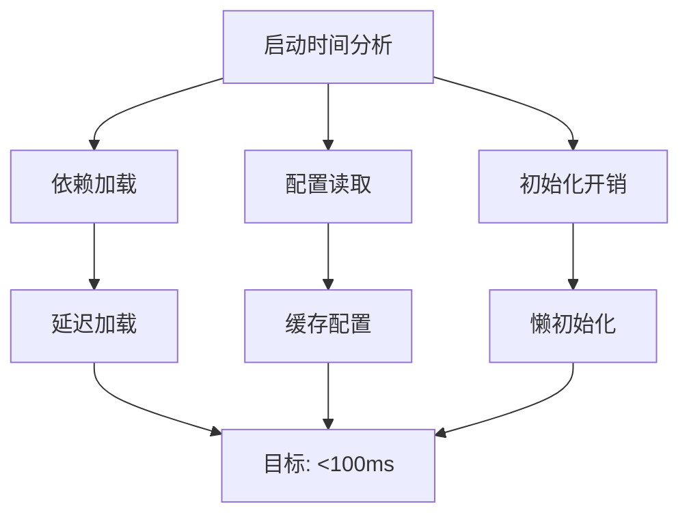
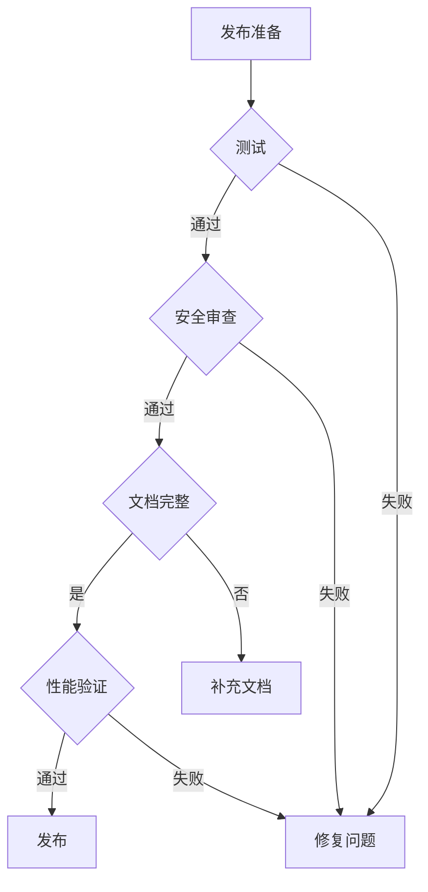
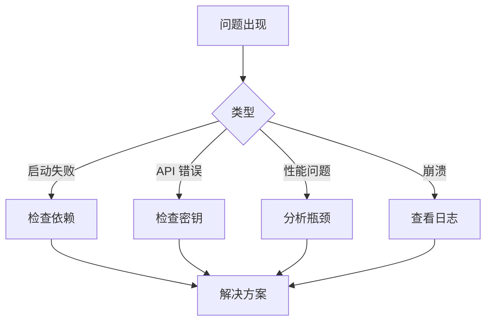
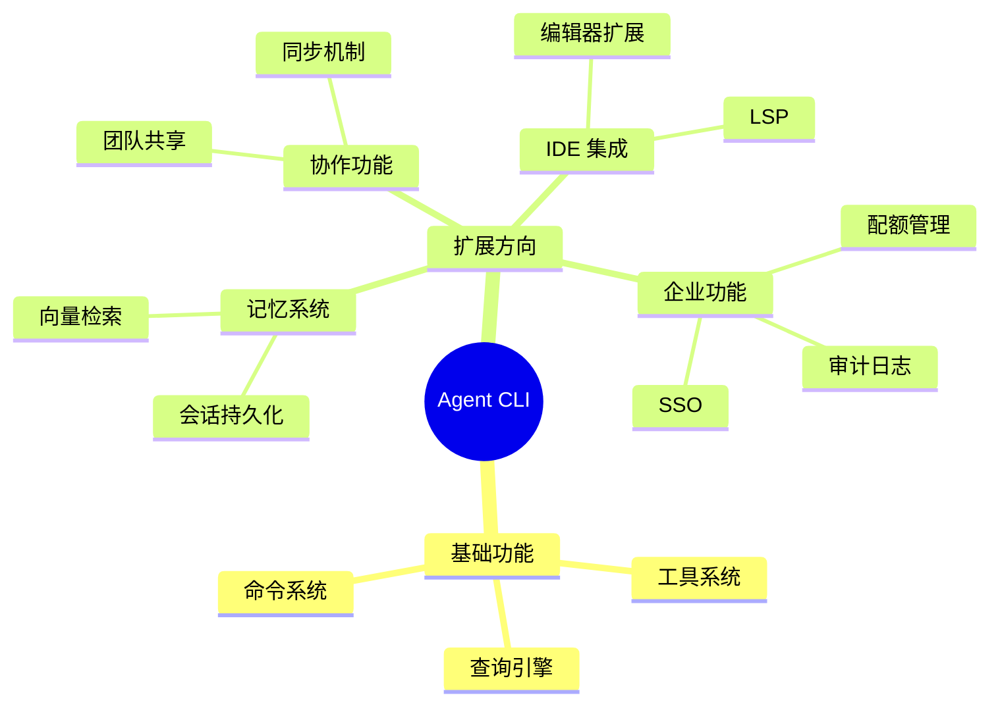

# 第 36 章：构建你的 CLI：从零到实战

> 本章目标：基于 Claude Code 的设计经验，提供构建 Agent CLI 工具的完整实践指南，从技术选型到生产部署。

## 36.1 章节概述：为什么要构建自己的 Agent CLI

在深入实践之前，让我们先明确：为什么你需要构建自己的 Agent CLI，而不是直接使用 Claude Code 或其他现有工具？



### 36.1.1 构建自己的理由

| 理由 | 描述 | 适用场景 |
|------|------|----------|
| **定制化需求** | 现有工具无法满足特定工作流 | 特殊行业、内部工具 |
| **数据隐私** | 需要完全控制数据和 API 密钥 | 企业环境、敏感项目 |
| **成本控制** | 需要优化 API 调用成本 | 预算有限、高频使用 |
| **集成需求** | 与内部系统深度集成 | 企业工作流自动化 |
| **学习目的** | 理解 AI Agent 的实现原理 | 技术研究、教育 |
| **产品开发** | 作为商业产品的一部分 | SaaS、企业软件 |

### 36.1.2 本章学习路径



## 36.2 技术选型决策框架

### 36.2.1 运行时选择



#### 详细对比矩阵

| 维度 | Bun | Node.js | Deno |
|------|-----|---------|------|
| **启动时间** | ~50ms | ~180ms | ~100ms |
| **TypeScript 支持** | 原生 | 需配置 | 原生 |
| **包管理** | 内置 | npm/yarn/pnpm | 内置 |
| **API 兼容** | Node.js 大部分 | 标准 | 部分 Node.js |
| **生态系统** | 快速增长 | 最成熟 | 较新 |
| **企业采用** | 早期 | 广泛 | 早期 |
| **调试工具** | 基础 | 成熟 | 中等 |
| **学习曲线** | 低 | 低 | 中 |

**推荐决策树：**

```
1. 如果是学习项目 → Bun（最简单）
2. 如果是企业环境 → Node.js（最稳定）
3. 如果是安全优先 → Deno（沙盒内置）
4. 如果追求性能 → Bun（最快启动）
```

### 36.2.2 LLM 提供商选择

| 提供商 | 优势 | 劣势 | 适用场景 |
|--------|------|------|----------|
| **Anthropic Claude** | 长上下文、代码能力强 | 价格较高 | 代码分析、复杂任务 |
| **OpenAI GPT-4** | 功能全面、生态成熟 | 上下文较短 | 通用任务 |
| **OpenAI o1** | 推理能力强 | 速度慢、价格高 | 复杂推理 |
| **本地模型** | 隐私、零成本 | 能力有限 | 隐私敏感、简单任务 |

### 36.2.3 UI 框架选择



| 框架 | 学习曲线 | 组件化 | 生态 | 推荐度 |
|------|----------|--------|------|--------|
| **React/Ink** | 低（React 开发者） | 高 | 好 | ⭐⭐⭐⭐⭐ |
| **blessed** | 高 | 低 | 中 | ⭐⭐⭐ |
| **terminal-kit** | 中 | 低 | 中 | ⭐⭐⭐ |
| **ink-drop** | 中 | 高 | 低 | ⭐⭐ |
| **Clorox** | 低 | 中 | 低 | ⭐⭐ |

## 36.3 项目架构设计

### 36.3.1 推荐的目录结构

```
agent-cli/
├── src/
│   ├── entrypoints/
│   │   ├── cli.tsx           # 主入口
│   │   └── init.ts           # 初始化
│   ├── core/
│   │   ├── QueryEngine.ts    # LLM 引擎
│   │   ├── Tool.ts           # 工具类型
│   │   └── Command.ts        # 命令类型
│   ├── tools/
│   │   ├── FileReadTool.ts   # 文件读取
│   │   ├── FileWriteTool.ts  # 文件写入
│   │   ├── BashTool.ts       # 命令执行
│   │   └── registry.ts       # 工具注册
│   ├── commands/
│   │   ├── help.ts           # 帮助命令
│   │   ├── clear.ts          # 清除命令
│   │   └── registry.ts       # 命令注册
│   ├── components/
│   │   ├── App.tsx           # 根组件
│   │   ├── Chat.tsx          # 聊天界面
│   │   └── Status.tsx        # 状态栏
│   ├── services/
│   │   ├── config.ts         # 配置服务
│   │   └── logger.ts         # 日志服务
│   ├── utils/
│   │   ├── stream.ts         # 流处理
│   │   └── security.ts       # 安全工具
│   └── types/
│       └── index.ts          # 类型定义
├── tests/
│   ├── unit/
│   └── integration/
├── docs/
├── package.json
├── tsconfig.json
└── README.md
```

### 36.3.2 核心架构图



### 36.3.3 分层架构详解

#### 第一层：用户交互层

```typescript
// src/entrypoints/cli.tsx
import { render } from 'ink'
import App from '../components/App'

async function main() {
  const config = await loadConfig()
  render(<App config={config} />)
}

main().catch(console.error)
```

#### 第二层：核心引擎层

```typescript
// src/core/QueryEngine.ts
export class QueryEngine {
  constructor(private config: EngineConfig) {}

  async *query(prompt: string): AsyncGenerator<StreamEvent> {
    // 实现细节见后文
  }
}
```

#### 第三层：工具系统层

```typescript
// src/tools/registry.ts
export class ToolRegistry {
  private tools = new Map<string, Tool>()

  register(tool: Tool): void {
    this.tools.set(tool.name, tool)
  }

  async execute(toolUse: ToolUse): Promise<string> {
    const tool = this.tools.get(toolUse.name)
    return await tool.execute(toolUse.input)
  }
}
```

#### 第四层：基础设施层

```typescript
// src/services/config.ts
export async function loadConfig(): Promise<Config> {
  const configPath = getConfigPath()
  const exists = await fileExists(configPath)

  if (!exists) {
    return createDefaultConfig()
  }

  return parseConfig(await readFile(configPath))
}
```

## 36.4 核心实现：QueryEngine

### 36.4.1 最小可行实现

```typescript
// src/core/QueryEngine.ts
import type { StreamOptions } from 'openai'

export type Message = {
  role: 'system' | 'user' | 'assistant'
  content: string
}

export type StreamEvent =
  | { type: 'text'; delta: string }
  | { type: 'tool_call'; tool: ToolUse }
  | { type: 'done' }
  | { type: 'error'; error: Error }

export type ToolUse = {
  id: string
  name: string
  input: Record<string, unknown>
}

export type QueryOptions = {
  tools?: Tool[]
  maxTokens?: number
  temperature?: number
}

export class QueryEngine {
  private client: OpenAI
  private history: Message[] = []

  constructor(private config: {
    apiKey: string
    baseURL?: string
    model: string
  }) {
    this.client = new OpenAI({
      apiKey: config.apiKey,
      baseURL: config.baseURL,
    })
  }

  /**
   * 核心查询方法
   * 使用异步生成器实现流式响应
   */
  async *query(
    prompt: string,
    options: QueryOptions = {},
  ): AsyncGenerator<StreamEvent> {
    // 添加用户消息到历史
    this.history.push({ role: 'user', content: prompt })

    try {
      // 调用 LLM API
      const stream = await this.callLLM(options)

      let fullContent = ''
      let toolCalls: ToolUse[] = []

      for await (const chunk of stream) {
        const delta = chunk.choices[0]?.delta

        // 处理文本内容
        if (delta?.content) {
          fullContent += delta.content
          yield { type: 'text', delta: delta.content }
        }

        // 处理工具调用
        if (delta?.tool_calls) {
          for (const call of delta.tool_calls) {
            toolCalls.push({
              id: call.id ?? this.generateId(),
              name: call.function?.name ?? '',
              input: JSON.parse(call.function?.arguments ?? '{}'),
            })
          }
        }

        // 检查是否完成
        if (chunk.choices[0]?.finish_reason) {
          // 保存助手响应
          this.history.push({ role: 'assistant', content: fullContent })

          // 发送工具调用事件
          for (const tool of toolCalls) {
            yield { type: 'tool_call', tool }
          }

          yield { type: 'done' }
        }
      }
    } catch (error) {
      yield { type: 'error', error: error as Error }
    }
  }

  /**
   * 添加工具执行结果
   */
  async addToolResult(toolUseId: string, result: string): Promise<void> {
    this.history.push({
      role: 'user',
      content: `[Tool Result for ${toolUseId}]:\n${result}`,
    })
  }

  /**
   * 调用 LLM API
   */
  private async *callLLM(
    options: QueryOptions,
  ): AsyncGenerator<StreamOptions> {
    const messages: Message[] = [
      { role: 'system', content: this.getSystemPrompt(options.tools) },
      ...this.history,
    ]

    const stream = await this.client.chat.completions.create({
      model: this.config.model,
      messages: messages as any,
      tools: options.tools?.map(toAPISchema),
      max_tokens: options.maxTokens ?? 4096,
      temperature: options.temperature ?? 0,
      stream: true,
    })

    yield* stream
  }

  /**
   * 生成系统提示
   */
  private getSystemPrompt(tools?: Tool[]): string {
    if (!tools || tools.length === 0) {
      return 'You are a helpful AI assistant.'
    }

    const toolsDesc = tools
      .map((t) => `- ${t.name}: ${t.description}`)
      .join('\n')

    return `You are a helpful AI assistant with access to the following tools:

${toolsDesc}

When you need to use a tool, respond with a tool call in the format:
<tool_call>
{"name": "tool_name", "input": {...}}
</tool_call>`
  }

  /**
   * 清空历史
   */
  clearHistory(): void {
    this.history = []
  }

  /**
   * 生成唯一 ID
   */
  private generateId(): string {
    return `tool_${Date.now()}_${Math.random().toString(36).slice(2, 9)}`
  }
}

/**
 * 将工具转换为 API 格式
 */
function toAPISchema(tool: Tool): any {
  return {
    type: 'function',
    function: {
      name: tool.name,
      description: tool.description,
      parameters: tool.inputSchema,
    },
  }
}
```

### 36.4.2 高级特性：自动工具执行

```typescript
// src/core/QueryEngine.ts 扩展
export class QueryEngine {
  // ... 之前的代码

  /**
   * 自动执行工具调用
   * 这是一个高级方法，自动处理工具调用循环
   */
  async *queryWithAutoTools(
    prompt: string,
    options: QueryOptions = {},
    toolRegistry: ToolRegistry,
  ): AsyncGenerator<StreamEvent> {
    let currentPrompt = prompt
    let iterations = 0
    const MAX_ITERATIONS = 10

    while (iterations < MAX_ITERATIONS) {
      iterations++

      // 执行查询
      for await (const event of this.query(currentPrompt, options)) {
        // 直接转发文本事件
        if (event.type === 'text' || event.type === 'error') {
          yield event
        }

        // 处理工具调用
        if (event.type === 'tool_call') {
          yield event

          try {
            // 执行工具
            const result = await toolRegistry.execute(event.tool)

            // 添加结果到历史
            await this.addToolResult(event.tool.id, result)

            // 继续查询（让 AI 看到结果）
            currentPrompt = '' // 空提示，继续之前的对话
            break // 重新开始循环
          } catch (error) {
            yield {
              type: 'error',
              error: new Error(`Tool execution failed: ${error}`),
            }
            return
          }
        }

        // 如果完成，结束循环
        if (event.type === 'done') {
          return
        }
      }
    }

    if (iterations >= MAX_ITERATIONS) {
      yield {
        type: 'error',
        error: new Error('Maximum tool iterations exceeded'),
      }
    }
  }
}
```

### 36.4.3 错误处理与重试

```typescript
// src/core/QueryEngine.ts 扩展
export class QueryEngine {
  // ... 之前的代码

  /**
   * 带重试的查询
   */
  async *queryWithRetry(
    prompt: string,
    options: QueryOptions & { maxRetries?: number } = {},
  ): AsyncGenerator<StreamEvent> {
    const maxRetries = options.maxRetries ?? 3
    let lastError: Error | null = null

    for (let attempt = 0; attempt < maxRetries; attempt++) {
      try {
        yield* this.query(prompt, options)
        return // 成功，退出
      } catch (error) {
        lastError = error as Error

        // 检查是否可重试
        if (!this.isRetryable(error)) {
          yield { type: 'error', error: lastError }
          return
        }

        // 指数退避
        const delay = Math.pow(2, attempt) * 1000
        yield { type: 'text', delta: `\n[Retrying in ${delay}ms...]` }
        await this.sleep(delay)
      }
    }

    // 所有重试都失败
    yield { type: 'error', error: lastError! }
  }

  /**
   * 判断错误是否可重试
   */
  private isRetryable(error: unknown): boolean {
    const message = (error as Error).message.toLowerCase()

    // 网络错误
    if (message.includes('network') || message.includes('timeout')) {
      return true
    }

    // 速率限制
    if (message.includes('rate limit') || message.includes('429')) {
      return true
    }

    // 服务器错误
    if (message.includes('5')) {
      return true
    }

    return false
  }

  private sleep(ms: number): Promise<void> {
    return new Promise((resolve) => setTimeout(resolve, ms))
  }
}
```

## 36.5 工具系统实现

### 36.5.1 工具类型定义

```typescript
// src/core/Tool.ts
export type Tool = {
  name: string
  description: string
  inputSchema: JSONSchema
  execute: (input: unknown) => Promise<string>
}

export type JSONSchema = {
  type: 'object'
  properties: Record<string, {
    type: string
    description: string
    enum?: string[]
  }>
  required: string[]
}

export type ToolUse = {
  id: string
  name: string
  input: Record<string, unknown>
}
```

### 36.5.2 工具注册表

```typescript
// src/tools/registry.ts
export class ToolRegistry {
  private tools = new Map<string, Tool>()

  /**
   * 注册工具
   */
  register(tool: Tool): void {
    if (this.tools.has(tool.name)) {
      throw new Error(`Tool already registered: ${tool.name}`)
    }
    this.tools.set(tool.name, tool)
  }

  /**
   * 批量注册
   */
  registerAll(tools: Tool[]): void {
    for (const tool of tools) {
      this.register(tool)
    }
  }

  /**
   * 获取工具
   */
  get(name: string): Tool | undefined {
    return this.tools.get(name)
  }

  /**
   * 列出所有工具
   */
  list(): Tool[] {
    return Array.from(this.tools.values())
  }

  /**
   * 执行工具
   */
  async execute(toolUse: ToolUse): Promise<string> {
    const tool = this.tools.get(toolUse.name)

    if (!tool) {
      throw new Error(`Unknown tool: ${toolUse.name}`)
    }

    try {
      return await tool.execute(toolUse.input)
    } catch (error) {
      return `Error: ${error}`
    }
  }

  /**
   * 验证工具输入
   */
  validateInput(toolName: string, input: unknown): boolean {
    const tool = this.tools.get(toolName)
    if (!tool) return false

    // 简单验证（生产环境应使用完整的 JSON Schema 验证库）
    const schema = tool.inputSchema
    const obj = input as Record<string, unknown>

    for (const required of schema.required) {
      if (!(required in obj)) {
        return false
      }
    }

    return true
  }
}
```

### 36.5.3 基础工具实现

#### 文件读取工具

```typescript
// src/tools/FileReadTool.ts
import { readFile } from 'fs/promises'

export const FileReadTool: Tool = {
  name: 'read_file',
  description: 'Read the contents of a file from the file system',

  inputSchema: {
    type: 'object',
    properties: {
      file_path: {
        type: 'string',
        description: 'Absolute path to the file to read',
      },
      start_line: {
        type: 'number',
        description: 'Optional line number to start reading from (1-indexed)',
      },
      end_line: {
        type: 'number',
        description: 'Optional line number to stop reading at',
      },
    },
    required: ['file_path'],
  },

  async execute(input: unknown): Promise<string> {
    const { file_path, start_line, end_line } = input as {
      file_path: string
      start_line?: number
      end_line?: number
    }

    try {
      let content = await readFile(file_path, 'utf-8')
      const lines = content.split('\n')

      // 处理行范围
      if (start_line !== undefined || end_line !== undefined) {
        const start = start_line ? Math.max(0, start_line - 1) : 0
        const end = end_line ? Math.min(lines.length, end_line) : lines.length
        content = lines.slice(start, end).join('\n')
      }

      return content
    } catch (error) {
      return `Error reading file: ${error}`
    }
  },
}
```

#### 文件写入工具

```typescript
// src/tools/FileWriteTool.ts
import { writeFile } from 'fs/promises'

export const FileWriteTool: Tool = {
  name: 'write_file',
  description: 'Write content to a file. Creates the file if it does not exist, overwrites if it does.',

  inputSchema: {
    type: 'object',
    properties: {
      file_path: {
        type: 'string',
        description: 'Absolute path to the file to write',
      },
      content: {
        type: 'string',
        description: 'Content to write to the file',
      },
    },
    required: ['file_path', 'content'],
  },

  async execute(input: unknown): Promise<string> {
    const { file_path, content } = input as {
      file_path: string
      content: string
    }

    try {
      await writeFile(file_path, content, 'utf-8')
      return `Successfully wrote ${content.length} bytes to ${file_path}`
    } catch (error) {
      return `Error writing file: ${error}`
    }
  },
}
```

#### 文件编辑工具

```typescript
// src/tools/FileEditTool.ts
import { readFile, writeFile } from 'fs/promises'

export const FileEditTool: Tool = {
  name: 'edit_file',
  description: 'Make edits to a file by replacing a specific string with new content.',

  inputSchema: {
    type: 'object',
    properties: {
      file_path: {
        type: 'string',
        description: 'Absolute path to the file to edit',
      },
      old_str: {
        type: 'string',
        description: 'The exact string to replace. Must be unique in the file.',
      },
      new_str: {
        type: 'string',
        description: 'The new content to replace the old string with',
      },
    },
    required: ['file_path', 'old_str', 'new_str'],
  },

  async execute(input: unknown): Promise<string> {
    const { file_path, old_str, new_str } = input as {
      file_path: string
      old_str: string
      new_str: string
    }

    try {
      const content = await readFile(file_path, 'utf-8')

      if (!content.includes(old_str)) {
        return `Error: The string to replace was not found in the file.`
      }

      const occurrences = (content.match(new RegExp(escapeRegExp(old_str), 'g')) || []).length
      if (occurrences > 1) {
        return `Error: The string to replace appears ${occurrences} times in the file. It must be unique.`
      }

      const newContent = content.replace(old_str, new_str)
      await writeFile(file_path, newContent, 'utf-8')

      return `Successfully replaced text in ${file_path}`
    } catch (error) {
      return `Error editing file: ${error}`
    }
  },
}

function escapeRegExp(string: string): string {
  return string.replace(/[.*+?^${}()|[\]\\]/g, '\\$&')
}
```

#### Bash 执行工具（带安全验证）

```typescript
// src/tools/BashTool.ts
import { spawn } from 'child_process'
import { validateCommand } from '../utils/security'

export const BashTool: Tool = {
  name: 'run_command',
  description: 'Execute a shell command and return the output',

  inputSchema: {
    type: 'object',
    properties: {
      command: {
        type: 'string',
        description: 'The command to execute',
      },
      timeout: {
        type: 'number',
        description: 'Optional timeout in milliseconds (default: 30000)',
      },
    },
    required: ['command'],
  },

  async execute(input: unknown): Promise<string> {
    const { command, timeout = 30000 } = input as {
      command: string
      timeout?: number
    }

    // 安全验证
    const validation = validateCommand(command)
    if (!validation.safe) {
      return `Security Error: ${validation.reason}`
    }

    return new Promise((resolve) => {
      const [cmd, ...args] = parseCommand(command)
      const proc = spawn(cmd, args, { shell: true })

      let stdout = ''
      let stderr = ''

      proc.stdout?.on('data', (data) => {
        stdout += data.toString()
      })

      proc.stderr?.on('data', (data) => {
        stderr += data.toString()
      })

      const timer = setTimeout(() => {
        proc.kill()
        resolve(`Error: Command timed out after ${timeout}ms`)
      }, timeout)

      proc.on('close', (code) => {
        clearTimeout(timer)
        if (code === 0) {
          resolve(stdout || stderr || 'Command completed with no output')
        } else {
          resolve(`Exit code ${code}\n${stderr || stdout}`)
        }
      })

      proc.on('error', (error) => {
        clearTimeout(timer)
        resolve(`Error: ${error.message}`)
      })
    })
  },
}

function parseCommand(command: string): [string, ...string[]] {
  // 简单的命令解析（生产环境应使用更健壮的解析器）
  return [command, ...[]]
}
```

#### 搜索工具（Grep）

```typescript
// src/tools/GrepTool.ts
import { execSync } from 'child_process'

export const GrepTool: Tool = {
  name: 'grep',
  description: 'Search for a pattern in files using ripgrep',

  inputSchema: {
    type: 'object',
    properties: {
      pattern: {
        type: 'string',
        description: 'The regex pattern to search for',
      },
      path: {
        type: 'string',
        description: 'Path to search in (default: current directory)',
      },
      file_pattern: {
        type: 'string',
        description: 'File pattern to filter (e.g., "*.ts")',
      },
    },
    required: ['pattern'],
  },

  async execute(input: unknown): Promise<string> {
    const { pattern, path = '.', file_pattern } = input as {
      pattern: string
      path?: string
      file_pattern?: string
    }

    try {
      let cmd = `rg "${pattern}" "${path}" --line-number --no-heading`

      if (file_pattern) {
        cmd += ` --glob "${file_pattern}"`
      }

      const output = execSync(cmd, { encoding: 'utf-8', maxBuffer: 10 * 1024 * 1024 })
      return output || 'No matches found'
    } catch (error: any) {
      if (error.status === 1) {
        return 'No matches found'
      }
      return `Error: ${error.message}`
    }
  },
}
```

#### Glob 工具

```typescript
// src/tools/GlobTool.ts
import { glob } from 'glob'

export const GlobTool: Tool = {
  name: 'glob',
  description: 'Find files matching a pattern',

  inputSchema: {
    type: 'object',
    properties: {
      pattern: {
        type: 'string',
        description: 'Glob pattern (e.g., "**/*.ts", "src/**/*.tsx")',
      },
      cwd: {
        type: 'string',
        description: 'Current working directory (default: process.cwd())',
      },
    },
    required: ['pattern'],
  },

  async execute(input: unknown): Promise<string> {
    const { pattern, cwd = process.cwd() } = input as {
      pattern: string
      cwd?: string
    }

    try {
      const files = await glob(pattern, { cwd })
      return files.join('\n')
    } catch (error) {
      return `Error: ${error}`
    }
  },
}
```

### 36.5.4 工具初始化

```typescript
// src/tools/index.ts
import { ToolRegistry } from './registry'
import { FileReadTool } from './FileReadTool'
import { FileWriteTool } from './FileWriteTool'
import { FileEditTool } from './FileEditTool'
import { BashTool } from './BashTool'
import { GrepTool } from './GrepTool'
import { GlobTool } from './GlobTool'

export function createToolRegistry(): ToolRegistry {
  const registry = new ToolRegistry()

  registry.registerAll([
    FileReadTool,
    FileWriteTool,
    FileEditTool,
    BashTool,
    GrepTool,
    GlobTool,
  ])

  return registry
}
```

## 36.6 命令系统实现

### 36.6.1 命令类型定义

```typescript
// src/core/Command.ts
export type Command = {
  name: string
  description: string
  handler: (args: string, context: CommandContext) => Promise<void>
}

export type CommandContext = {
  queryEngine: QueryEngine
  toolRegistry: ToolRegistry
  config: Config
  ui?: UIInterface
}

export interface UIInterface {
  print(message: string): void
  clear(): void
  exit(): void
}
```

### 36.6.2 命令注册表

```typescript
// src/commands/registry.ts
export class CommandRegistry {
  private commands = new Map<string, Command>()

  register(command: Command): void {
    this.commands.set(command.name, command)
  }

  get(name: string): Command | undefined {
    return this.commands.get(name)
  }

  list(): Command[] {
    return Array.from(this.commands.values())
  }

  async execute(name: string, args: string, context: CommandContext): Promise<void> {
    const command = this.commands.get(name)

    if (!command) {
      throw new Error(`Unknown command: ${name}`)
    }

    await command.handler(args, context)
  }

  /**
   * 解析命令字符串
   * 返回 [commandName, args] 或 null
   */
  parse(input: string): [string, string] | null {
    const match = input.match(/^\/(\w+)(?:\s+(.*))?$/)

    if (!match) return null

    return [match[1], match[2] || '']
  }
}
```

### 36.6.3 基础命令实现

```typescript
// src/commands/index.ts
import { CommandRegistry } from './registry'

export function createCommandRegistry(): CommandRegistry {
  const registry = new CommandRegistry()

  // Help 命令
  registry.register({
    name: 'help',
    description: 'Show available commands and tools',
    handler: async (_args, context) => {
      const { print } = context.ui || { print: console.log }

      print('\n=== Commands ===\n')
      for (const cmd of context.commandRegistry?.list() || []) {
        print(`  /${cmd.name.padEnd(12)} ${cmd.description}`)
      }

      print('\n=== Tools ===\n')
      for (const tool of context.toolRegistry?.list() || []) {
        print(`  ${tool.name.padEnd(15)} ${tool.description}`)
      }
    },
  })

  // Clear 命令
  registry.register({
    name: 'clear',
    description: 'Clear conversation history',
    handler: async (_args, context) => {
      context.queryEngine.clearHistory()
      context.ui?.clear()
      context.ui?.print('Conversation history cleared.')
    },
  })

  // Model 命令
  registry.register({
    name: 'model',
    description: 'Switch to a different model',
    handler: async (args, context) => {
      if (!args.trim()) {
        context.ui?.print(`Current model: ${context.config.model}`)
        return
      }

      context.config.model = args.trim()
      context.ui?.print(`Model switched to: ${args.trim()}`)
    },
  })

  // Exit 命令
  registry.register({
    name: 'exit',
    description: 'Exit the CLI',
    handler: async (_args, context) => {
      context.ui?.exit()
    },
  })

  // Quit 命令（exit 别名）
  registry.register({
    name: 'quit',
    description: 'Exit the CLI (alias for /exit)',
    handler: async (_args, context) => {
      context.ui?.exit()
    },
  })

  return registry
}
```

## 36.7 React/Ink UI 实现

### 36.7.1 根组件

```typescript
// src/components/App.tsx
import { useState, useCallback, useEffect } from 'react'
import { Box, Text } from 'ink'
import Chat from './Chat'
import Input from './Input'
import StatusBar from './StatusBar'

export default function App({ config }: { config: Config }) {
  const [messages, setMessages] = useState<Message[]>([])
  const [isProcessing, setIsProcessing] = useState(false)
  const [currentModel, setCurrentModel] = useState(config.model)

  const queryEngine = useMemo(() => new QueryEngine(config), [config])
  const toolRegistry = useMemo(() => createToolRegistry(), [])
  const commandRegistry = useMemo(() => createCommandRegistry(), [])

  const handleSubmit = useCallback(async (input: string) => {
    // 检查是否是命令
    const parsed = commandRegistry.parse(input)
    if (parsed) {
      const [name, args] = parsed
      await commandRegistry.execute(name, args, {
        queryEngine,
        toolRegistry,
        config,
        ui: { print: console.log, clear: () => setMessages([]) },
      })
      return
    }

    // 添加用户消息
    setMessages((prev) => [...prev, { role: 'user', content: input }])
    setIsProcessing(true)

    try {
      let assistantMessage = ''

      for await (const event of queryEngine.queryWithAutoTools(
        input,
        { tools: toolRegistry.list() },
        toolRegistry,
      )) {
        if (event.type === 'text') {
          assistantMessage += event.delta
          setMessages((prev) => {
            const newMessages = [...prev]
            const last = newMessages[newMessages.length - 1]
            if (last?.role === 'assistant') {
              last.content = assistantMessage
            } else {
              newMessages.push({ role: 'assistant', content: assistantMessage })
            }
            return newMessages
          })
        }

        if (event.type === 'tool_call') {
          setMessages((prev) => [
            ...prev,
            {
              role: 'system',
              content: `Using tool: ${event.tool.name}`,
            },
          ])
        }

        if (event.type === 'done') {
          setIsProcessing(false)
        }

        if (event.type === 'error') {
          setMessages((prev) => [
            ...prev,
            {
              role: 'error',
              content: event.error.message,
            },
          ])
          setIsProcessing(false)
        }
      }
    } catch (error) {
      setMessages((prev) => [
        ...prev,
        {
          role: 'error',
          content: `Error: ${error}`,
        },
      ])
      setIsProcessing(false)
    }
  }, [queryEngine, toolRegistry, commandRegistry, config])

  return (
    <Box flexDirection="column" height="100%">
      <StatusBar model={currentModel} isProcessing={isProcessing} />
      <Chat messages={messages} />
      <Input onSubmit={handleSubmit} disabled={isProcessing} />
    </Box>
  )
}
```

### 36.7.2 聊天组件

```typescript
// src/components/Chat.tsx
import { Box, Text } from 'ink'
import type { Message } from '../core/QueryEngine'

interface ChatProps {
  messages: Message[]
}

export default function Chat({ messages }: ChatProps) {
  return (
    <Box flexDirection="column" flexGrow={1} paddingX={1}>
      {messages.length === 0 && (
        <Box>
          <Text dimColor>
            Type a message or /help for commands. Press Ctrl+C to exit.
          </Text>
        </Box>
      )}

      {messages.map((msg, index) => (
        <MessageBubble key={index} message={msg} />
      ))}
    </Box>
  )
}

function MessageBubble({ message }: { message: Message }) {
  const style = getStyle(message.role)

  return (
    <Box marginBottom={1} flexDirection="column">
      <Box>
        <Text bold color={style.color}>
          {style.prefix}
        </Text>
      </Box>
      <Box paddingLeft={2}>
        <Text>{message.content}</Text>
      </Box>
    </Box>
  )
}

function getStyle(role: string) {
  switch (role) {
    case 'user':
      return { prefix: 'You:', color: 'blue' }
    case 'assistant':
      return { prefix: 'Assistant:', color: 'green' }
    case 'system':
      return { prefix: 'System:', color: 'yellow' }
    case 'error':
      return { prefix: 'Error:', color: 'red' }
    default:
      return { prefix: '', color: 'white' }
  }
}
```

### 36.7.3 输入组件

```typescript
// src/components/Input.tsx
import { useState, useEffect } from 'react'
import { Box, Text } from 'ink'
import TextInput from 'ink-text-input'

interface InputProps {
  onSubmit: (value: string) => void
  disabled?: boolean
}

export default function Input({ onSubmit, disabled }: InputProps) {
  const [value, setValue] = useState('')

  const handleSubmit = () => {
    if (value.trim()) {
      onSubmit(value)
      setValue('')
    }
  }

  return (
    <Box paddingX={1}>
      <Text color={disabled ? 'gray' : 'blue'}>{'> '}</Text>
      <TextInput
        value={value}
        onChange={setValue}
        onSubmit={handleSubmit}
        placeholder="Type a message..."
        disabled={disabled}
      />
    </Box>
  )
}
```

### 36.7.4 状态栏组件

```typescript
// src/components/StatusBar.tsx
import { Box, Text } from 'ink'

interface StatusBarProps {
  model: string
  isProcessing: boolean
}

export default function StatusBar({ model, isProcessing }: StatusBarProps) {
  return (
    <Box
      borderStyle="single"
      borderColor="gray"
      paddingX={1}
      justifyContent="space-between"
    >
      <Text bold>Agent CLI</Text>
      <Box>
        <Text color="cyan">{model}</Text>
        {' '}
        {isProcessing && (
          <Text color="yellow">● Processing...</Text>
        )}
      </Box>
    </Box>
  )
}
```

## 36.8 安全实现

### 36.8.1 命令安全验证

```typescript
// src/utils/security.ts
export type SecurityValidation = {
  safe: boolean
  reason?: string
}

const DANGEROUS_COMMANDS = [
  'rm -rf /',
  'rm -rf /*',
  'mkfs',
  'dd if=/dev/zero',
  '> /dev/sda',
  'chmod 000',
  'chown -R',
  'curl',
  'wget',
]

const DANGEROUS_PATTERNS = [
  /\|\s*rm\s+/,
  /;\s*rm\s+/,
  /&&\s*rm\s+/,
  /`.*\$\(.*\)/,  // 命令替换
  /\$\(.*\)/,     // 命令替换
]

export function validateCommand(command: string): SecurityValidation {
  // 检查危险命令
  for (const dangerous of DANGEROUS_COMMANDS) {
    if (command.includes(dangerous)) {
      return {
        safe: false,
        reason: `Dangerous command detected: ${dangerous}`,
      }
    }
  }

  // 检查危险模式
  for (const pattern of DANGEROUS_PATTERNS) {
    if (pattern.test(command)) {
      return {
        safe: false,
        reason: 'Dangerous command pattern detected',
      }
    }
  }

  return { safe: true }
}

/**
 * 路径安全验证
 */
export function validatePath(baseDir: string, userPath: string): SecurityValidation {
  const resolved = require('path').resolve(baseDir, userPath)

  if (!resolved.startsWith(baseDir)) {
    return {
      safe: false,
      reason: 'Path traversal detected',
    }
  }

  return { safe: true }
}
```

### 36.8.2 API 密钥管理

```typescript
// src/services/config.ts
import * as keytar from 'keytar'

const SERVICE_NAME = 'agent-cli'

export async function getApiKey(): Promise<string | null> {
  // 1. 检查环境变量
  const envKey = process.env.AGENT_API_KEY || process.env.ANTHROPIC_API_KEY
  if (envKey) return envKey

  // 2. 检查密钥链
  const key = await keytar.getPassword(SERVICE_NAME, 'api-key')
  if (key) return key

  // 3. 提示用户输入
  return null
}

export async function saveApiKey(apiKey: string): Promise<void> {
  await keytar.setPassword(SERVICE_NAME, 'api-key', apiKey)
}

export async function clearApiKey(): Promise<void> {
  await keytar.deletePassword(SERVICE_NAME, 'api-key')
}
```

## 36.9 配置管理

### 36.9.1 配置结构

```typescript
// src/types/config.ts
export type Config = {
  // API 配置
  apiKey: string
  baseURL?: string
  model: string

  // 行为配置
  maxTokens: number
  temperature: number
  maxRetries: number

  // 安全配置
  allowedPaths: string[]
  sandboxMode: boolean

  // UI 配置
  theme: 'light' | 'dark'
  showTimestamps: boolean

  // 高级配置
  debug: boolean
  logPath?: string
}
```

### 36.9.2 配置加载

```typescript
// src/services/config.ts
import path from 'path'
import { homedir } from 'os'
import { readFile, writeFile, mkdir } from 'fs/promises'

const CONFIG_DIR = path.join(homedir(), '.agent-cli')
const CONFIG_FILE = path.join(CONFIG_DIR, 'config.json')

export async function loadConfig(): Promise<Config> {
  try {
    const content = await readFile(CONFIG_FILE, 'utf-8')
    const saved = JSON.parse(content)

    return {
      apiKey: saved.apiKey || '',
      baseURL: saved.baseURL,
      model: saved.model || 'claude-opus-4-6',
      maxTokens: saved.maxTokens || 4096,
      temperature: saved.temperature ?? 0,
      maxRetries: saved.maxRetries || 3,
      allowedPaths: saved.allowedPaths || [],
      sandboxMode: saved.sandboxMode ?? true,
      theme: saved.theme || 'dark',
      showTimestamps: saved.showTimestamps ?? false,
      debug: saved.debug || false,
      logPath: saved.logPath,
    }
  } catch {
    // 默认配置
    return {
      apiKey: '',
      model: 'claude-opus-4-6',
      maxTokens: 4096,
      temperature: 0,
      maxRetries: 3,
      allowedPaths: [],
      sandboxMode: true,
      theme: 'dark',
      showTimestamps: false,
      debug: false,
    }
  }
}

export async function saveConfig(config: Config): Promise<void> {
  await mkdir(CONFIG_DIR, { recursive: true })
  await writeFile(CONFIG_FILE, JSON.stringify(config, null, 2))
}
```

## 36.10 构建与打包

### 36.10.1 Bun 配置

```json
{
  "name": "agent-cli",
  "version": "1.0.0",
  "type": "module",
  "scripts": {
    "dev": "bun src/entrypoints/cli.tsx",
    "build": "bun build src/entrypoints/cli.tsx --outdir ./dist --target bun",
    "build:prod": "bun build src/entrypoints/cli.tsx --compile --outfile ./dist/agent",
    "typecheck": "tsc --noEmit"
  },
  "dependencies": {
    "ink": "^4.4.1",
    "ink-text-input": "^5.0.1",
    "openai": "^4.20.0",
    "glob": "^10.3.0",
    "keytar": "^7.9.0"
  },
  "devDependencies": {
    "@types/bun": "latest",
    "typescript": "^5.3.0"
  }
}
```

### 36.10.2 跨平台编译

```bash
#!/bin/bash
# scripts/build-all.sh

set -e

echo "Building for all platforms..."

# macOS ARM64
bun build --compile --target=bun-aarch64-apple-darwin \
  --outfile=./dist/agent-darwin-arm64 \
  src/entrypoints/cli.tsx

# macOS x64
bun build --compile --target=bun-x64-apple-darwin \
  --outfile=./dist/agent-darwin-x64 \
  src/entrypoints/cli.tsx

# Linux x64
bun build --compile --target=bun-x64-linux \
  --outfile=./dist/agent-linux-x64 \
  src/entrypoints/cli.tsx

# Windows x64
bun build --compile --target=bun-x64-windows \
  --outfile=./dist/agent-windows-x64.exe \
  src/entrypoints/cli.tsx

echo "Build complete!"
ls -lh ./dist/
```

### 36.10.3 NPM 包发布

```json
{
  "name": "agent-cli",
  "version": "1.0.0",
  "bin": {
    "agent": "./dist/agent"
  },
  "files": [
    "dist",
    "README.md",
    "LICENSE"
  ],
  "os": [
    "darwin",
    "linux",
    "win32"
  ],
  "engines": {
    "bun": ">=1.1.0"
  }
}
```

## 36.11 测试策略

### 36.11.1 单元测试

```typescript
// tests/unit/ToolRegistry.test.ts
import { describe, it, expect } from 'bun:test'
import { ToolRegistry } from '../../src/tools/registry'
import { FileReadTool } from '../../src/tools/FileReadTool'

describe('ToolRegistry', () => {
  it('should register and retrieve tools', () => {
    const registry = new ToolRegistry()
    registry.register(FileReadTool)

    const tool = registry.get('read_file')
    expect(tool).toBeDefined()
    expect(tool?.name).toBe('read_file')
  })

  it('should throw on duplicate registration', () => {
    const registry = new ToolRegistry()
    registry.register(FileReadTool)

    expect(() => registry.register(FileReadTool)).toThrow()
  })

  it('should execute tools', async () => {
    const registry = new ToolRegistry()
    registry.register({
      name: 'echo',
      description: 'Echo input',
      inputSchema: {
        type: 'object',
        properties: { text: { type: 'string' } },
        required: ['text'],
      },
      execute: async (input) => `Echo: ${input}`,
    })

    const result = await registry.execute({
      id: 'test',
      name: 'echo',
      input: { text: 'hello' },
    })

    expect(result).toBe('Echo: hello')
  })
})
```

### 36.11.2 集成测试

```typescript
// tests/integration/query.test.ts
import { describe, it, expect } from 'bun:test'
import { QueryEngine } from '../../src/core/QueryEngine'

describe('QueryEngine Integration', () => {
  it('should handle tool calls', async () => {
    const engine = new QueryEngine({
      apiKey: process.env.TEST_API_KEY || '',
      model: 'claude-opus-4-6',
    })

    const results: string[] = []

    for await (const event of engine.query('What is 2+2?')) {
      if (event.type === 'text') {
        results.push(event.delta)
      }
      if (event.type === 'done') break
    }

    expect(results.join('').length).toBeGreaterThan(0)
  })
})
```

## 36.12 性能优化

### 36.12.1 启动时间优化



**优化技巧：**

```typescript
// 延迟加载工具
class LazyToolRegistry {
  private tools?: Map<string, Tool>

  getRegistry(): Map<string, Tool> {
    if (!this.tools) {
      this.tools = new Map()
      // 按需加载
    }
    return this.tools
  }
}

// 懒初始化服务
let configService: ConfigService | null = null

function getConfig(): ConfigService {
  if (!configService) {
    configService = new ConfigService()
  }
  return configService
}
```

### 36.12.2 内存管理

```typescript
// 历史管理
class HistoryManager {
  private messages: Message[] = []
  private maxSize: number

  constructor(maxSize = 1000) {
    this.maxSize = maxSize
  }

  add(message: Message): void {
    this.messages.push(message)

    // 自动截断
    if (this.messages.length > this.maxSize) {
      this.messages = this.messages.slice(-this.maxSize)
    }
  }

  // 估算 token 使用
  estimateTokens(): number {
    return this.messages.reduce((sum, msg) => {
      return sum + Math.ceil(msg.content.length / 4)
    }, 0)
  }

  // 智能压缩历史
  compress(maxTokens: number): Message[] {
    let tokens = this.estimateTokens()

    if (tokens <= maxTokens) {
      return this.messages
    }

    // 保留最近的和重要的消息
    return this.messages.filter((msg) => {
      return msg.role === 'system' || this.messages.indexOf(msg) > this.messages.length / 2
    })
  }
}
```

## 36.13 部署清单

### 36.13.1 发布前检查



**检查清单：**

| 类别 | 项目 | 状态 |
|------|------|------|
| **代码质量** | 类型检查通过 | ☐ |
| | 代码检查通过 | ☐ |
| | 测试覆盖 > 80% | ☐ |
| **安全** | API 密钥未泄露 | ☐ |
| | 沙盒有效 | ☐ |
| | 路径验证工作 | ☐ |
| **性能** | 启动 < 200ms | ☐ |
| | 内存合理 | ☐ |
| | 无明显泄漏 | ☐ |
| **文档** | README 完整 | ☐ |
| | CHANGELOG 更新 | ☐ |
| | 许可证包含 | ☐ |

### 36.13.2 版本发布

```bash
#!/bin/bash
# scripts/release.sh

set -e

VERSION=$1

if [ -z "$VERSION" ]; then
  echo "Usage: ./release.sh <version>"
  exit 1
fi

echo "Releasing version $VERSION..."

# 更新版本
npm version $VERSION

# 构建所有平台
bun run scripts/build-all.sh

# 生成 SHA 校验和
cd dist
shasum -a 256 * > SHA256SUMS
cd ..

# 创建 Git 标签
git tag -a "v$VERSION" -m "Release v$VERSION"
git push origin "v$VERSION"

# 发布到 NPM
npm publish

echo "Release $VERSION complete!"
```

## 36.14 常见问题与解决方案

### 36.14.1 问题诊断流程



### 36.14.2 常见问题

| 问题 | 可能原因 | 解决方案 |
|------|----------|----------|
| `Cannot find module` | 依赖未安装 | `bun install` |
| `401 Unauthorized` | API 密钥无效 | 检查 `ANTHROPIC_API_KEY` |
| `Timeout` | 网络问题或请求过大 | 增加超时时间 |
| `Out of memory` | 历史过长 | 清空历史或增加限制 |
| 工具执行失败 | 权限不足或路径错误 | 检查路径和权限 |

## 36.15 进阶主题

### 36.15.1 添加 MCP 支持

```typescript
// src/services/mcp.ts
import { Client } from '@modelcontextprotocol/sdk/client/index'

export class MCPService {
  private clients = new Map<string, Client>()

  async connectServer(name: string, command: string[]): Promise<void> {
    const client = new Client({
      name: `agent-cli-${name}`,
      version: '1.0.0',
    }, {
      capabilities: {},
    })

    await client.connect(command)
    this.clients.set(name, client)
  }

  async listTools(serverName: string): Promise<any[]> {
    const client = this.clients.get(serverName)
    if (!client) throw new Error(`Server not found: ${serverName}`)

    const result = await client.listTools()
    return result.tools
  }

  async callTool(serverName: string, toolName: string, args: any): Promise<any> {
    const client = this.clients.get(serverName)
    if (!client) throw new Error(`Server not found: ${serverName}`)

    const result = await client.callTool({
      name: toolName,
      arguments: args,
    })

    return result.content
  }
}
```

### 36.15.2 多模态支持

```typescript
// src/core/QueryEngine.ts 扩展
export type MultiModalContent =
  | { type: 'text'; text: string }
  | { type: 'image'; source: { type: 'url'; url: string } }

export class QueryEngine {
  async *queryMultiModal(
    content: MultiModalContent[],
    options: QueryOptions = {},
  ): AsyncGenerator<StreamEvent> {
    const messages: any[] = [
      {
        role: 'user',
        content: content,
      },
    ]

    // 调用支持图片的模型
    const stream = await this.client.chat.completions.create({
      model: 'claude-opus-4-6',
      messages,
      max_tokens: options.maxTokens ?? 4096,
      stream: true,
    })

    yield* stream
  }
}
```

### 36.15.3 插件系统

```typescript
// src/plugins/types.ts
export type Plugin = {
  name: string
  version: string
  activate: (context: PluginContext) => void
  deactivate?: () => void
}

export type PluginContext = {
  registerTool: (tool: Tool) => void
  registerCommand: (command: Command) => void
  config: Config
}

// src/plugins/manager.ts
export class PluginManager {
  private plugins = new Map<string, Plugin>()

  async load(pluginPath: string): Promise<void> {
    const module = await import(pluginPath)
    const plugin: Plugin = module.default

    plugin.activate({
      registerTool: (tool) => toolRegistry.register(tool),
      registerCommand: (cmd) => commandRegistry.register(cmd),
      config: await loadConfig(),
    })

    this.plugins.set(plugin.name, plugin)
  }

  unload(pluginName: string): void {
    const plugin = this.plugins.get(pluginName)
    plugin?.deactivate?.()
    this.plugins.delete(pluginName)
  }
}
```

## 36.16 可复用模式总结

### 模式 1：异步生成器模式

**描述：** 使用异步生成器处理流式响应

**代码模板：**

```typescript
async function* streamProcessor(
  source: AsyncStream,
): AsyncGenerator<ProcessedEvent> {
  for await (const chunk of source) {
    // 处理逻辑
    yield process(chunk)
  }
}
```

### 模式 2：注册表模式

**描述：** 使用注册表管理可扩展组件

**代码模板：**

```typescript
class Registry<T> {
  private items = new Map<string, T>()

  register(name: string, item: T): void {
    this.items.set(name, item)
  }

  get(name: string): T | undefined {
    return this.items.get(name)
  }

  list(): T[] {
    return Array.from(this.items.values())
  }
}
```

### 模式 3：中间件模式

**描述：** 使用中间件处理请求/响应

**代码模板：**

```typescript
type Middleware = (
  input: Input,
  next: () => Promise<Output>,
) => Promise<Output>

class Pipeline {
  private middlewares: Middleware[] = []

  use(middleware: Middleware): void {
    this.middlewares.push(middleware)
  }

  async process(input: Input): Promise<Output> {
    let index = 0

    const next = async (): Promise<Output> => {
      if (index < this.middlewares.length) {
        return this.middlewares[index++](input, next)
      }
      return defaultHandler(input)
    }

    return next()
  }
}
```

### 模式 4：单例模式

**描述：** 确保服务只有一个实例

**代码模板：**

```typescript
class SingletonService {
  private static instance: SingletonService

  private constructor() {}

  static getInstance(): SingletonService {
    if (!SingletonService.instance) {
      SingletonService.instance = new SingletonService()
    }
    return SingletonService.instance
  }
}
```

### 模式 5：工厂模式

**描述：** 根据配置创建不同实现

**代码模板：**

```typescript
interface Engine {
  query(prompt: string): Promise<string>
}

class OpenAIEngine implements Engine { /* ... */ }
class ClaudeEngine implements Engine { /* ... */ }

class EngineFactory {
  static create(config: Config): Engine {
    switch (config.provider) {
      case 'openai':
        return new OpenAIEngine(config)
      case 'claude':
        return new ClaudeEngine(config)
      default:
        throw new Error(`Unknown provider: ${config.provider}`)
    }
  }
}
```

## 36.17 设计权衡讨论

### 36.17.1 复杂度与灵活性

**问题：** 何时引入抽象层？

**原则：**
1. **重复三次**：相同代码出现三次时才抽象
2. **YAGNI**：不需要时不添加
3. **渐进式**：从简单开始，按需重构

### 36.17.2 性能与开发体验

**权衡：**
- TypeScript 类型安全 vs 编译开销
- 抽象层级 vs 调用性能
- 错误处理完整性 vs 代码简洁性

**建议：** CLI 工具优先考虑启动性能，其次考虑运行时性能

### 36.17.3 依赖管理

**策略：**
- 优先选择零依赖方案
- 选择维护活跃的库
- 定期审计依赖安全性

## 36.18 下一步

构建完基础 CLI 后，可以考虑以下扩展方向：



## 本章小结

本章从零开始介绍了构建 Agent CLI 工具的完整流程：

1. **技术选型**：运行时、LLM 提供商、UI 框架的决策框架
2. **架构设计**：分层架构和推荐的目录结构
3. **核心实现**：QueryEngine、工具系统、命令系统的详细代码
4. **UI 实现**：React/Ink 组件示例
5. **安全考虑**：命令验证、密钥管理
6. **配置管理**：加载和保存配置
7. **构建部署**：跨平台编译和发布
8. **测试策略**：单元测试和集成测试
9. **性能优化**：启动时间和内存管理
10. **进阶主题**：MCP、多模态、插件系统

通过本章的指南，你应该能够构建一个功能完整的 Agent CLI 工具，并根据自己的需求进行定制和扩展。

## 参考资源

- **Bun 文档**：https://bun.sh/docs
- **Ink 文档**：https://github.com/vadimdemedes/ink
- **Anthropic API**：https://docs.anthropic.com
- **MCP 协议**：https://modelcontextprotocol.io
- **Claude Code 源码**：https://github.com/anthropics/claude-code
