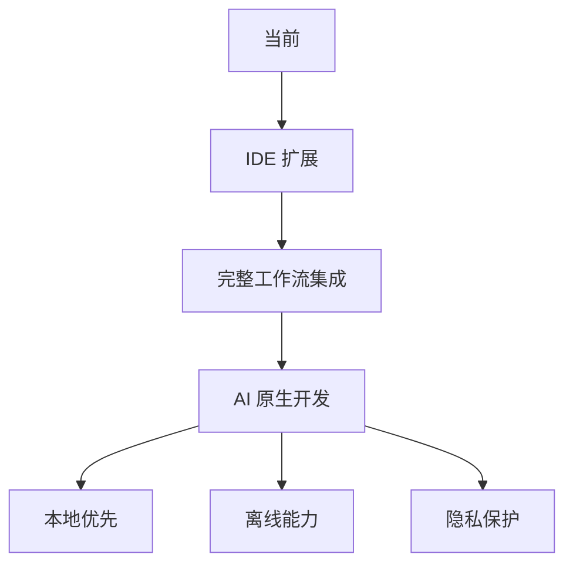
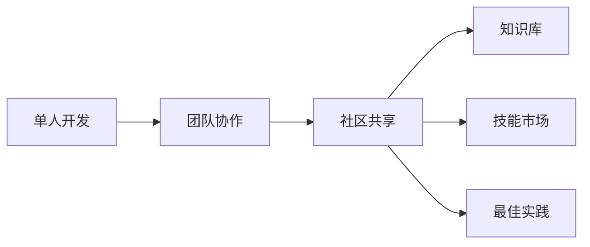
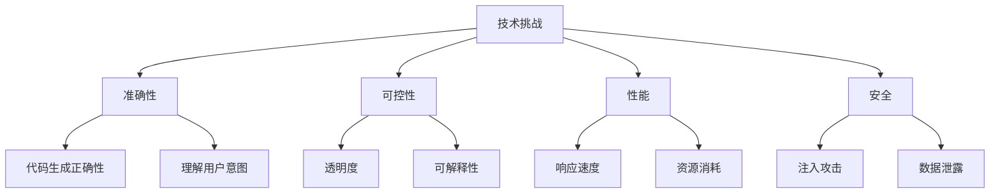
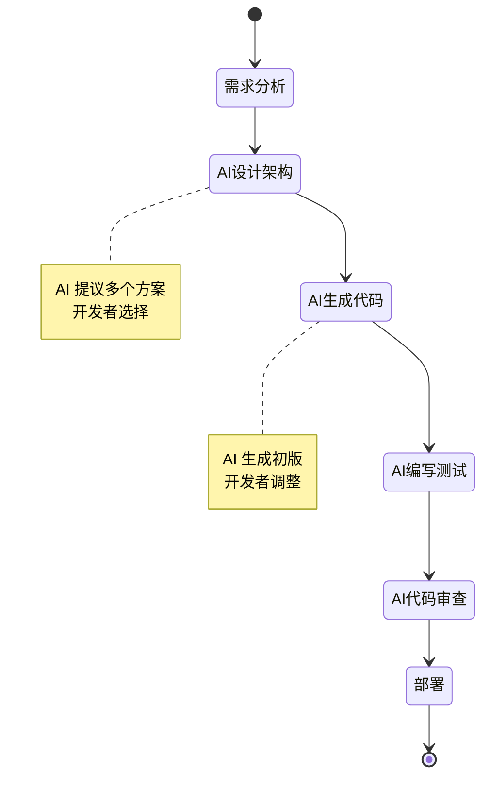

# 第 37 章：未来展望

> 本章探讨 Claude Code 和 AI 开发工具的未来发展方向。

## 当前状态评估

### 已实现的核心能力

| 能力 | 成熟度 | 说明 |
|------|--------|------|
| 命令执行 | 成熟 | Bash/PowerShell 支持 |
| 文件操作 | 成熟 | 读写编辑完善 |
| 代码理解 | 良好 | 通过 LSP 和搜索 |
| 多 Agent | 发展中 | 框架已建立 |
| 记忆系统 | 创新中 | 四层架构独特 |
| 团队协作 | 早期 | 基础支持 |

### 技术债务

1. **QueryEngine 单文件**：需要拆分
2. **测试覆盖**：部分核心功能缺少测试
3. **文档完善**：高级功能文档不足
4. **性能优化**：大项目启动慢

## 未来发展方向

### 1. 更深度的 IDE 集成



**预期特性：**
- VS Code 深度集成（已完成）
- JetBrains 系列支持
- Vim/Neovim 集成
- 终端原生集成

### 2. 多模态能力扩展

| 当前 | 未来 |
|------|------|
| 文本/代码 | 语音输入 |
| 图像理解 | 视频分析 |
| - | 屏幕理解 |
| - | UI 交互 |

### 3. 边缘 AI 支持

```typescript
// 本地模型支持
interface LocalModelConfig {
  provider: 'ollama' | 'lmstudio' | 'jan'
  model: string
  fallbackToCloud: boolean
  capabilities: {
    maxTokens: number
    supportsTools: boolean
    supportsVision: boolean
  }
}
```

**优势：**
- 隐私保护
- 延迟降低
- 成本节省
- 离线可用

### 4. 协作增强



### 5. 自适应学习

```typescript
// 个性化系统
interface Personalization {
  codingStyle: {
    language: string[]
    frameworks: string[]
    patterns: Pattern[]
  }
  preferences: {
    verbosity: 'concise' | 'detailed'
    toolPreference: string[]
    autoApprove: string[]
  }
  learning: {
    fromHistory: boolean
    fromTeam: boolean
    fromCommunity: boolean
  }
}
```

## 技术演进趋势

### 短期（6-12 个月）

1. **性能优化**
   - 启动时间 < 100ms
   - 响应延迟 < 500ms
   - 内存占用 < 200MB

2. **功能完善**
   - 完整的 MCP 生态
   - 丰富的技能市场
   - 强大的调试能力

3. **用户体验**
   - 更平滑的学习曲线
   - 更好的错误处理
   - 更清晰的进度反馈

### 中期（1-2 年）

1. **架构演进**
   - 微内核化
   - 插件系统
   - 分布式执行

2. **能力提升**
   - 多模态完整支持
   - 本地模型成熟
   - 实时协作

3. **生态建设**
   - 标准化协议
   - 开发者社区
   - 商业支持

### 长期（2-5 年）

1. **范式转移**
   - AI 原生开发
   - 自然编程
   - 自主系统

2. **技术融合**
   - IDE 深度融合
   - 操作系统集成
   - 云边协同

3. **社会影响**
   - 开发门槛降低
   - 效率大幅提升
   - 新角色出现

## 挑战与风险

### 技术挑战



### 伦理考虑

1. **版权问题**：AI 生成的代码归属
2. **责任归属**：AI 错误导致的损失
3. **就业影响**：对开发者职业的影响
4. **依赖风险**：过度依赖 AI 的风险

## 对行业的影响

### 开发者角色演变

| 传统角色 | 新角色 | 变化 |
|----------|--------|------|
| 码农 | 架构师 | 从编写到设计 |
| 独奏者 | 指挥家 | 从实现到协调 |
| 学习者 | 引导者 | 从学习到训练 |

### 开发流程变化



## 结语

Claude Code 代表了 AI 与软件开发工作流融合的最新尝试。它的四层记忆架构、工具优先系统和 MCP 协议都是创新性的设计。

未来，随着 AI 技术的演进，我们可以期待：
- 更自然的开发体验
- 更强大的协作能力
- 更智能的学习系统
- 更完善的生态支持

但同时，我们也需要谨慎面对挑战：
- 确保代码质量和安全
- 保持人类的主导地位
- 建立合理的伦理框架
- 培养新的技能要求

AI 不会取代开发者，但使用 AI 的开发者会取代不使用 AI 的开发者。

---

*全书完*
