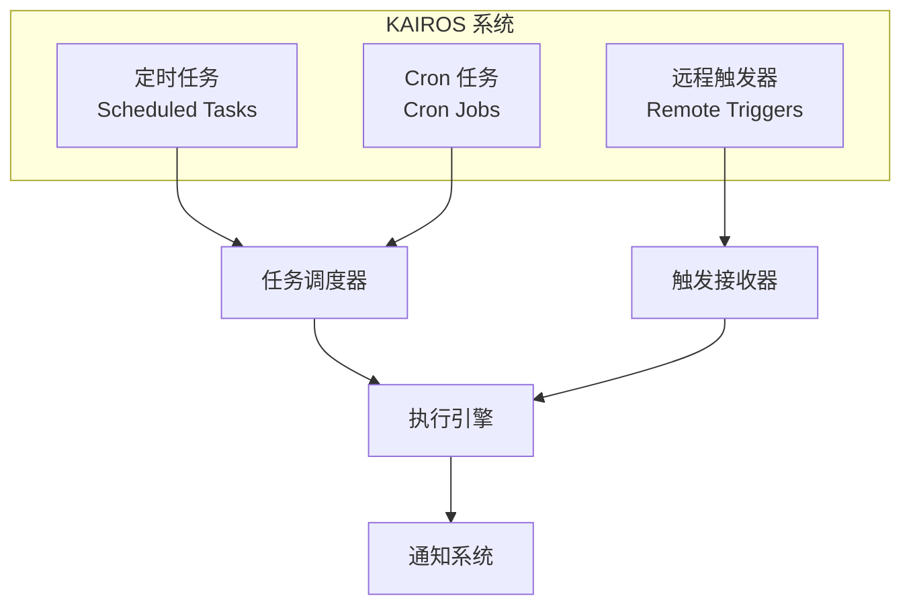
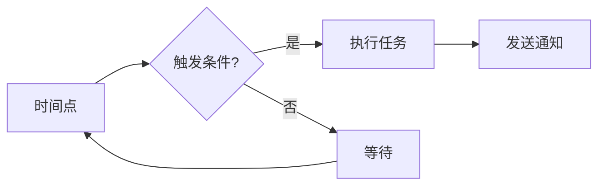

# KAIROS-01：KAIROS 系统介绍

> KAIROS 是 Claude Code 的定时任务和远程触发系统，本文是其系列介绍。

## KAIROS 名称由来

KAIROS（希腊语：καιρός）意为"关键时刻"、"恰当时机"。在古希腊哲学中，Kairos 代表机会、时机和决断时刻，与 Chronos（顺序时间）相对。

这个命名非常贴切地描述了系统的核心功能：在特定时间点触发特定操作。

## 系统概述

## 主要组件

### 1. 定时任务（Scheduled Tasks）

基于时间的任务调度，支持：
- 延迟执行
- 间隔执行
- 定时执行

### 2. Cron 任务（Cron Jobs）

标准 Cron 表达式支持：
- 分钟级精度
- Cron 语法
- 时区支持

### 3. 远程触发器（Remote Triggers）

通过 HTTP 触发的任务执行：
- Webhook 接收
- 认证机制
- 负载均衡

## 设计理念

**核心原则：**
1. **精确性**：准时执行
2. **可靠性**：任务不丢失
3. **可观测性**：完整的执行日志

## 使用场景

| 场景 | 工具 | 说明 |
|------|------|------|
| 每日构建 | Cron | `0 0 * * *` 每天 0 点 |
| 定期备份 | Cron | `0 2 * * 0` 每周日凌晨 2 点 |
| 延迟操作 | Scheduled | 等待 5 分钟后执行 |
| CI/CD 触发 | Remote | Push 时触发构建 |

## 系列文章结构

1. **本文**：KAIROS 系统介绍
2. **第 2 章**：定时任务系统
3. **第 3 章**：Cron 任务实现
4. **第 4 章**：远程触发器
5. **第 5 章**：最佳实践

## 下一章

第 2 章将深入分析定时任务系统的实现细节。
