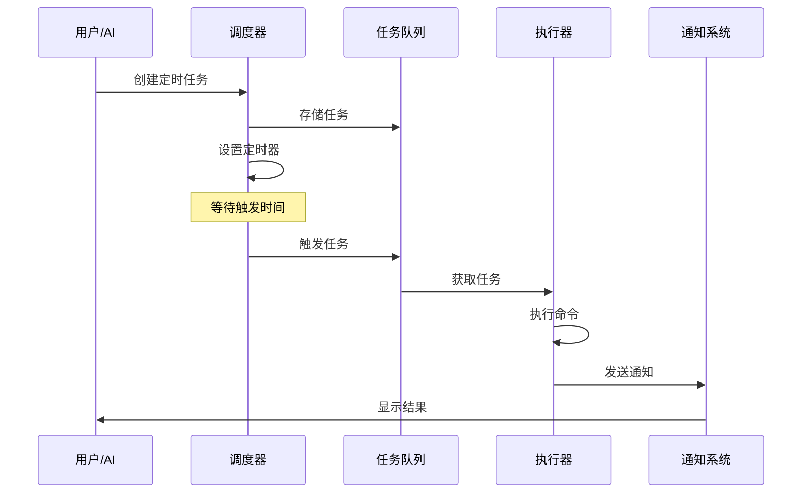
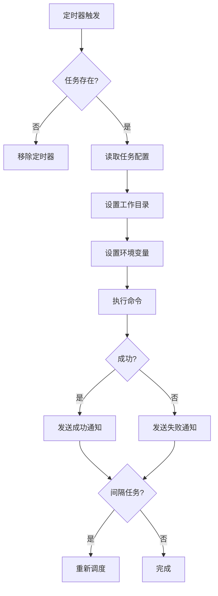

# KAIROS-02：定时任务系统

> 深入分析 KAIROS 的定时任务调度机制。

## 任务调度架构



## 任务定义

```typescript
interface ScheduledTask {
  id: string
  name: string
  command: string
  trigger: {
    type: 'delay' | 'interval' | 'once'
    delay?: number        // 毫秒
    interval?: number     // 毫秒
    timestamp?: number    // Unix 时间戳
  }
  options: {
    timeout?: number
    cwd?: string
    env?: Record<string, string>
  }
}
```

## 调度类型

### 1. 延迟执行

```typescript
// 延迟 5 分钟后执行
const task: ScheduledTask = {
  id: 'task-1',
  name: 'Delayed build',
  command: 'npm run build',
  trigger: {
    type: 'delay',
    delay: 5 * 60 * 1000,  // 5 分钟
  },
}
```

### 2. 间隔执行

```typescript
// 每 10 分钟执行一次
const task: ScheduledTask = {
  id: 'task-2',
  name: 'Health check',
  command: 'curl -f localhost:3000/health || exit 1',
  trigger: {
    type: 'interval',
    interval: 10 * 60 * 1000,  // 10 分钟
  },
}
```

### 3. 定时执行

```typescript
// 在指定时间执行
const task: ScheduledTask = {
  id: 'task-3',
  name: 'Midnight backup',
  command: 'backup.sh',
  trigger: {
    type: 'once',
    timestamp: getNextMidnight(),
  },
}
```

## 执行流程



## 背景任务管理

```typescript
// 后台任务状态管理
interface BackgroundTaskState {
  taskId: string
  status: 'pending' | 'running' | 'completed' | 'failed'
  startTime?: number
  endTime?: number
  output?: string
  error?: string
}

// 任务注册表
const taskRegistry = new Map<string, BackgroundTaskState>()

// 创建任务
function createScheduledTask(task: ScheduledTask): string {
  const taskId = generateId()

  // 设置定时器
  const timer = setTimeout(async () => {
    await executeTask(taskId, task)
  }, getTriggerDelay(task.trigger))

  // 存储任务
  taskRegistry.set(taskId, {
    taskId,
    status: 'pending',
  })

  return taskId
}
```

## 通知机制

任务执行完成后通过多种方式通知用户：

```typescript
interface NotificationOptions {
  inApp: boolean        // 应用内通知
  desktop?: boolean     // 桌面通知
  webhook?: string      // Webhook 回调
}

function notifyCompletion(task: ScheduledTask, result: ExecutionResult) {
  // 1. 应用内通知
  if (result.options.inApp) {
    showInAppNotification({
      title: task.name,
      message: result.success ? 'Completed' : 'Failed',
    })
  }

  // 2. 桌面通知
  if (result.options.desktop) {
    showDesktopNotification({
      title: task.name,
      body: result.output,
    })
  }

  // 3. Webhook 回调
  if (result.options.webhook) {
    fetch(result.options.webhook, {
      method: 'POST',
      body: JSON.stringify(result),
    })
  }
}
```

## 本章小结

本章介绍了 KAIROS 定时任务系统：
- 任务调度架构
- 三种调度类型
- 执行流程
- 后台任务管理
- 通知机制

## 下一章

第 3 章将介绍 Cron 任务的实现。
