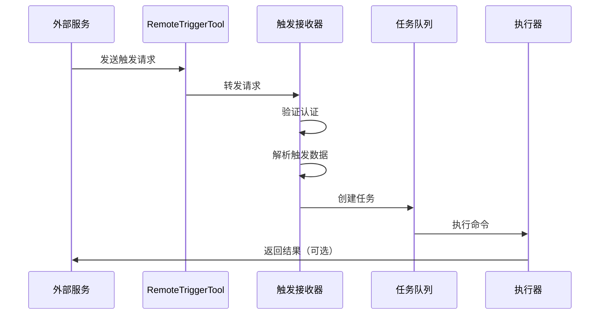

# KAIROS-04：远程触发器

> 深入分析 KAIROS 的远程触发机制。

## 远程触发架构



## 触发类型

### 1. HTTP Webhook

```typescript
interface WebhookTrigger {
  type: 'webhook'
  url: string
  method: 'POST' | 'GET' | 'PUT'
  headers?: Record<string, string>
  body?: unknown
  auth?: {
    type: 'bearer' | 'basic' | 'custom'
    token?: string
    username?: string
    password?: string
  }
}
```

### 2. 定时轮询

```typescript
interface PollingTrigger {
  type: 'polling'
  url: string
  interval: number
  condition: (response: Response) => boolean
}
```

### 3. 事件触发

```typescript
interface EventTrigger {
  type: 'event'
  source: 'github' | 'gitlab' | 'bitbucket'
  events: string[]
  filters?: Record<string, string>
}
```

## RemoteTriggerTool 实现

```typescript
interface RemoteTriggerInput {
  url: string
  method?: 'POST' | 'GET'
  headers?: Record<string, string>
  body?: unknown
  expectedStatus?: number
  timeout?: number
}

async function triggerRemote(input: RemoteTriggerInput) {
  // 1. 验证 URL
  const parsed = new URL(input.url)

  // 2. 设置默认值
  const method = input.method || 'POST'
  const timeout = input.timeout || 30000

  // 3. 发送请求
  const controller = new AbortController()
  const timeoutId = setTimeout(() => controller.abort(), timeout)

  try {
    const response = await fetch(parsed.toString(), {
      method,
      headers: {
        'Content-Type': 'application/json',
        ...input.headers,
      },
      body: input.body ? JSON.stringify(input.body) : undefined,
      signal: controller.signal,
    })

    clearTimeout(timeoutId)

    // 4. 检查状态码
    if (input.expectedStatus && response.status !== input.expectedStatus) {
      throw new Error(`Expected status ${input.expectedStatus}, got ${response.status}`)
    }

    // 5. 返回响应
    const data = await response.json()
    return {
      success: true,
      status: response.status,
      data,
    }
  } catch (error) {
    clearTimeout(timeoutId)
    return {
      success: false,
      error: error.message,
    }
  }
}
```

## 认证机制

### Bearer Token

```typescript
interface BearerAuth {
  type: 'bearer'
  token: string
}

function addAuth(headers: Record<string, string>, auth: BearerAuth) {
  return {
    ...headers,
    'Authorization': `Bearer ${auth.token}`,
  }
}
```

### Basic Auth

```typescript
interface BasicAuth {
  type: 'basic'
  username: string
  password: string
}

function addAuth(headers: Record<string, string>, auth: BasicAuth) {
  const credentials = btoa(`${auth.username}:${auth.password}`)
  return {
    ...headers,
    'Authorization': `Basic ${credentials}`,
  }
}
```

### 自定义认证

```typescript
interface CustomAuth {
  type: 'custom'
  header: string
  value: string
}

function addAuth(headers: Record<string, string>, auth: CustomAuth) {
  return {
    ...headers,
    [auth.header]: auth.value,
  }
}
```

## 安全考虑

### 1. URL 验证

```typescript
function validateTriggerUrl(url: string): boolean {
  const parsed = new URL(url)

  // 只允许 HTTPS（生产环境）
  if (process.env.NODE_ENV === 'production' && parsed.protocol !== 'https:') {
    throw new Error('Only HTTPS URLs allowed in production')
  }

  // 检查内网 IP（可选）
  const hostname = parsed.hostname
  if (isPrivateIP(hostname)) {
    throw new Error('Private IP addresses not allowed')
  }

  return true
}
```

### 2. 速率限制

```typescript
class RateLimiter {
  private requests: Map<string, number[]> = new Map()
  private window = 60000  // 1 分钟
  private maxRequests = 10

  canMakeRequest(key: string): boolean {
    const now = Date.now()
    const timestamps = this.requests.get(key) || []

    // 移除过期记录
    const valid = timestamps.filter(t => now - t < this.window)

    if (valid.length >= this.maxRequests) {
      return false
    }

    valid.push(now)
    this.requests.set(key, valid)
    return true
  }
}
```

## 错误处理

```typescript
interface TriggerResult {
  success: boolean
  status?: number
  data?: unknown
  error?: string
  retryable?: boolean
}

function handleError(error: Error): TriggerResult {
  // 网络错误
  if (error.name === 'AbortError') {
    return {
      success: false,
      error: 'Request timeout',
      retryable: true,
    }
  }

  // DNS 错误
  if (error.message.includes('ENOTFOUND')) {
    return {
      success: false,
      error: 'Host not found',
      retryable: false,
    }
  }

  // 默认
  return {
    success: false,
    error: error.message,
    retryable: true,
  }
}
```

## 本章小结

本章介绍了 KAIROS 的远程触发机制：
- 触发类型
- RemoteTriggerTool 实现
- 认证机制
- 安全考虑
- 错误处理

## 下一章

第 5 章将介绍 KAIROS 最佳实践。
